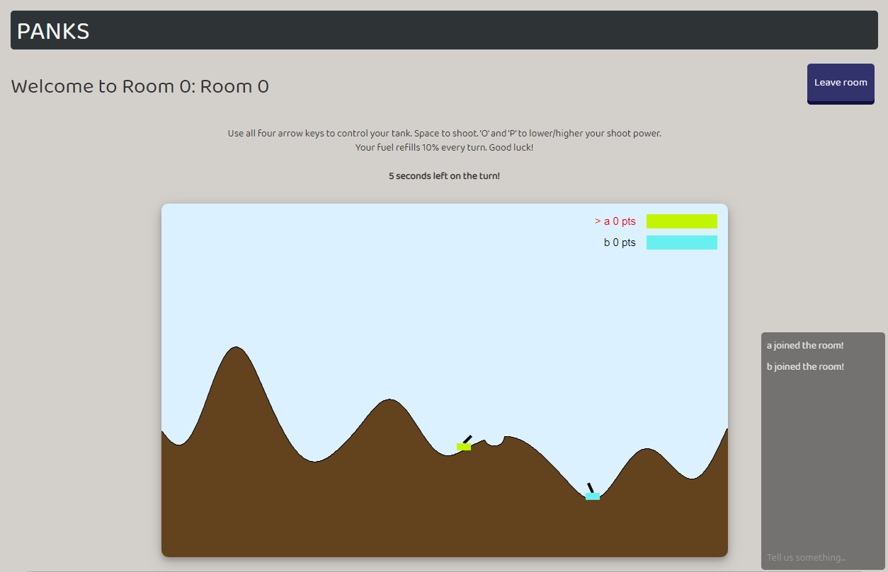
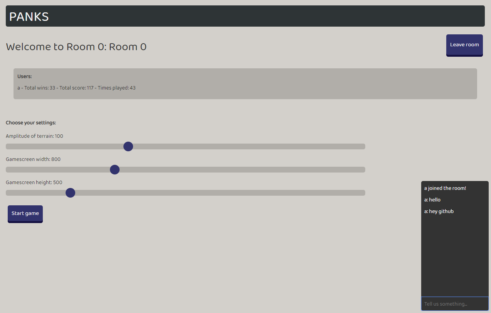

# panks

## A simple clone of the flash classic Tanks with online multiplayer support

## How to play:

- cd to /panks/
- Install necessary packages with `npm install`
- `npm start` to setup a server
  - It's way better to play it on different devices with port forwarding instead of just locally
- Go to https://localhost:3000 (or your IP-adress with the same :3000 port)
- Invite your friends

### A game in progress

### Player changing game settings

